# 🛡️ Code Sprint Backend

Backend for the Code Sprint project that enables users to run code, collaboratively write code with others, chat, draw together, and interact with terminal.

> For frontned repo [Click here](https://github.com/khaftab/code-sprint-frontend) or check out the [live preview here](https://code-sprint.khaftab.me).

## 🏗️ Architecture Overview

```mermaid
%%{init: {'theme': 'default', 'fontFamily': 'Segoe UI', 'sequence': {'boxMargin': 8}}}%%
sequenceDiagram
    participant F as 🖥️ Frontend
    participant C as 🎛️ Controller
    participant D as 🐳 Docker
    participant R as 🚀 Runner
    participant DB as 🗃️ Database

    Note over F,C: User Joins Room
    F->>C: 📨 POST /join-room (roomId)
    alt ✅ Existing Room
        C->>DB: 🔍 Check mapping
        DB-->>C: 📌 {path: "room_abc123"}
    else 🆕 New Room
        C->>D: 🏗️ Create container
        D-->>C: 🔗 Port & ContainerID
        C->>C: 📝 Update nginx.conf
        C->>DB: 💾 Store {path, port}
    end
    C-->>F: 📦 Return path "room_abc123"

    Note over F,R: Real-Time Connection
    F->>C: 🌐 Connect to /room_abc123
    Note right of C: Nginx proxies to<br>host.docker.internal:${port}
    C->>R: 🔀 Route traffic
    R-->>F: 🤝 Socket.IO established

    loop 🔄 Active Session
        F->>R: ✏️ Edits (code, files, chat, drawing)
        R->>F: 📢 Sync to all users
        F->>R: 💻 Terminal commands
        R->>F: 📋 Execution output
    end

    Note over C,R: 🕒 Cleanup After Inactivity
    C->>R:  Ping check
    alt ⏳ 30min inactive
        C->>D: 💀 Kill container
        C->>C: 🗑️ Remove nginx route
        C->>DB: 🧹 Delete record
    end
```



### Core Components

- **Controller Server**

  - Manages room lifecycle and user sessions
  - Orchestrates Docker container allocation
  - Handles NGINX routing configuration
  - REST API endpoints for room management

- **Runner Containers**
  - Isolated execution environments per room
  - Socket.IO server for real-time communication
  - Terminal process with PTY support
  - **Filesystem Watcher**
    - Uses `chokidar` to detect file changes inside the container (e.g., edits made via terminal).
    - Automatically broadcasts file updates to all connected users in the room.
    - When files are changed from the editor, changes are saved to the filesystem and updates are broadcast to other users.
  - Real-time sync for:
    - Code editing
    - File changes (from terminal or editor)
    - Live drawing
    - Chat

---

## 📋 Prerequisites

Make sure you have the following installed before getting started:

- 🐳 Docker & Docker Compose
- 🧰 Node.js (v18 or above recommended)
- 🍃 MongoDB Atlas or self-hosted MongoDB instance
- ✅ A domain name (for production)

---

## 🛠️ Getting Started (Development)

### 1. Clone the repository

```bash
git clone https://github.com/khaftab/code-sprint-backend
cd code-sprint-backend/runner
```

### 2. Build the `runner` image

```bash
docker build -t runner-prod -f ./Dockerfile.prod .
```

### 3. Update MongoDB URI

Edit the `docker-compose.dev.yml` file and update the `MONGO_URI` environment variable with your actual MongoDB connection string.

### 4. Start the Controller Server

```bash
cd controller
docker-compose -f docker-compose.dev.yml up --build
```

> 💡 The server will be accessible at:  
> [`http://localhost:8080`](http://localhost:8080)

### 🔁 How it works:

- All incoming requests are routed through **Nginx** (running on port `8080`).
- To access the controller server without nginx, you can directly use the port `1337` (e.g., `http://localhost:1337`).
- Nginx handles proxying to the **controller server** and **runner containers**.

---

## 🚀 Deploying to Production

Make sure you:

- Update MongoDB URI in `docker-compose.prod.yml`
- Configure your **domain name** and **SSL certificates**

### 1. Install Certbot (for SSL)

```bash
sudo apt update
sudo apt install certbot -y
```

### 2. Generate SSL Certificate

```bash
sudo certbot certonly --standalone -d your_domain.com
```

> 📁 This will generate certificates inside `/etc/letsencrypt/live/your_domain.com/`

### 3. Update SSL Path in Compose File

Make sure the following volume is mounted in `docker-compose.prod.yml`:

```yaml
volumes:
  - /etc/letsencrypt:/etc/letsencrypt:ro
```

### 4. Update Domain in Nginx Config

Edit `config/nginx.prod.conf` and replace:

```nginx
server_name your_domain.com;
```

With your actual domain name.

---

## 📎 Additional Notes

- `runner-prod` is the isolated container where your code runs.
- Nginx dynamically proxies paths like `/runner/room-id` to the correct Docker container internally.
- Idle runner containers are cleaned up automatically after a timeout.
- WebSocket (Socket.IO) is used for all collaborative features like:

  - Code sync
  - Terminal sharing
  - Drawing
  - Chat

- The frontend periodically calls a **heartbeat API** on the controller server; the controller then looks up the room in the database and updates its `lastActivity` timestamp.
- All code files, chat history, and other data are stored within the runner container and persist until the room is deleted or the container is automatically cleaned up due to inactivity.
